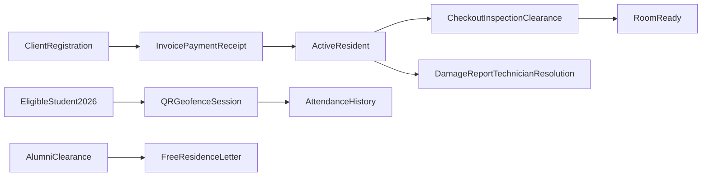

# Penyelesaian End-to-End Proses Bisnis

## Hasil audit saat ini

- **Pendaftaran asrama:** backend registration action, pilihan kamar, metadata KIPK, dan fondasi billing tersedia, tetapi belum ada halaman Inertia client yang menghubungkan pendaftaran → pilihan kamar → invoice → pembayaran → kuitansi.
- **Checkout:** pengajuan client dan action penyelesaian tersedia, tetapi UI operasional untuk GO, Admin Aset/Admin Layanan, dan Fasilitator belum lengkap; inspeksi/finding/foto belum tersambung penuh.
- **Bebas asrama:** pengajuan dan approval tersedia, tetapi percabangan alumni ≤ 2025, verifikasi bukti/rekening koran, tarif per angkatan, invoice/VA, jalur non-alumni, notifikasi surat, dan status nonaktif belum lengkap end-to-end.
- **Pelaporan kerusakan:** lifecycle backend tersedia, tetapi controller masih membuat laporan langsung dan belum konsisten memakai action; foto awal, assignment teknisi, bukti selesai, dan tampilan pimpinan belum seluruhnya tersambung.
- **Absensi:** flow aktif masih absensi sholat/barcode. Flow bisnis terbaru membutuhkan activity session dengan QR, waktu, lokasi/radius, validasi fasilitator dan mahasiswa, pembatasan mahasiswa lokal angkatan 2026, riwayat, dan penutupan sesi; action/migration activity attendance sudah ada namun belum terhubung ke route/page.
- **Migration:** konflik tabel dan index MySQL sudah diperbaiki serta migration berhasil dijalankan; perubahan berikutnya harus mempertahankan kompatibilitas non-destruktif.

## Implementasi bertahap

1. **Fondasi domain dan aturan bisnis**
    - Tetapkan kategori client dan status eligibility secara eksplisit untuk lokal KIPK, lokal non-KIPK, penghuni lokal, internasional gratis, dan non-mahasiswa.
    - Tambahkan service/action teruji untuk invoice nol KIPK/internasional gratis, pilihan kamar, cicilan/VA, kuitansi, dan keberhasilan pendaftaran.
    - Tambahkan aturan mahasiswa binaan: hanya mahasiswa lokal angkatan 2026 yang masih berada pada tahun pertama dan belum checkout permanen.

2. **Pendaftaran end-to-end**
    - Buat route/page Inertia client untuk form pendaftaran, pilihan kamar, invoice, status pembayaran, dan kuitansi.
    - Buat page/payload Admin Layanan untuk review pendaftaran, penyesuaian cicilan/tagihan, dan verifikasi pembayaran.
    - Pastikan semua mutasi memakai controller + Form Request/action + redirect Inertia dan tersimpan dalam transaksi database.

3. **Checkout multi-aktor**
    - Buat page/payload operasional untuk GO melakukan inspeksi kamar, mengisi temuan/foto, dan menghasilkan laporan kerusakan bila diperlukan.
    - Buat page Admin Aset/Admin Layanan untuk clearance aset dan keuangan.
    - Buat page Fasilitator untuk finalisasi checkout.
    - Pastikan transaksi final mengakhiri placement, mengubah status client, dan membuat kamar `kosong`/siap check-in.

4. **Bebas asrama lengkap**
    - Buat wizard/payload berdasarkan tahun masuk: alumni ≤ 2025 dan client mulai 2026.
    - Tambahkan upload bukti pembayaran dan rekening koran, validasi/rejection message, pengaturan tarif per angkatan, invoice/VA untuk tunggakan, dan pengecekan apakah pemohon benar alumni.
    - Integrasikan approval/pembayaran sukses dengan job penerbitan surat, notifikasi akun/email, dan status user nonaktif.

5. **Pelaporan kerusakan lengkap**
    - Gunakan action domain terpusat untuk laporan baru.
    - Tambahkan upload foto awal client, assignment/claim teknisi, bukti foto penyelesaian dan catatan teknisi.
    - Tampilkan tiket aktif/selesai pada dashboard teknisi dan pimpinan dengan history status serta scope authorization.

6. **Absensi kegiatan QR-geofencing**
    - Hubungkan `OpenAttendanceSession`, `CloseAttendanceSession`, dan `RecordAttendanceAttempt` ke route/controller/page Inertia.
    - Tambahkan QR bertanda session, waktu mulai/berakhir, latitude/longitude/radius, validasi lokasi fasilitator dan mahasiswa, serta penolakan jika waktu habis atau salah satu di luar radius.
    - Sediakan halaman fasilitator untuk membuat/menutup QR dan riwayat, serta halaman mahasiswa binaan untuk scan.

7. **Testing dan verifikasi**
    - Tambahkan feature tests untuk setiap transisi sukses dan failure: authorization, eligibility, upload, invoice nol, cicilan, kamar, status, geofence, expired QR, dan persistence.
    - Verifikasi Inertia props/redirects, bukan endpoint JSON terpisah.
    - Jalankan Pint, migration status/migrate, test suite terkait, Wayfinder, TypeScript check, dan frontend build.
    - Audit ulang dan laporkan dengan status `implemented`, `partial`, atau `backlog`; proses monitoring perizinan, laundry, galon, dan pendataan aset tetap tidak termasuk scope ini.

## Alur target

## File area utama

- `app/Actions/Registration`, `app/Actions/Billing`, `app/Actions/Checkout`, `app/Actions/Attendance`
- `app/Http/Controllers/ResidenceRegistrationController.php`, `CheckoutController.php`, `PengajuanController.php`, `TiketController.php`, `AbsensiController.php`, `RolePageController.php`
- `routes/role-pages.php`, `routes/andalas.php`
- `resources/js/andalas/pages/**`, `resources/js/pages/**`
- `database/migrations/**`
- `tests/Feature/**`
